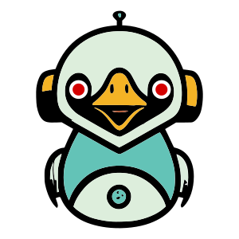

# 🪿 LinGoose [](https://github.com/henomis/lingoose/actions/workflows/checks.yml) [](https://godoc.org/github.com/henomis/lingoose) [](https://goreportcard.com/report/github.com/henomis/lingoose) [](https://github.com/henomis/lingoose/releases)


## What is LinGoose?

[LinGoose](https://github.com/henomis/lingoose) is a Go framework for building awesome AI/LLM applications.<br/>

- **LinGoose is modular** — You can import only the modules you need to build your application.
- **LinGoose is an abstraction of features** — You can choose your preferred implementation of a feature and/or create your own.
- **LinGoose is a complete solution** — You can use LinGoose to build your AI/LLM application from the ground up.

> **Did you know?** A goose 🪿 fills its car 🚗 with goose-line ⛽!

🚀 Support the project by starring ⭐ the repository on [GitHub](https://github.com/henomis/lingoose) and sharing it with your friends!

## Quick start
1. [Initialise a new go module](https://golang.org/doc/tutorial/create-module)

```sh
mkdir example
cd example
go mod init example
```

2. Create your first LinGoose application

```go
package main

import (
	"context"
	"fmt"

	"github.com/henomis/lingoose/llm/openai"
	"github.com/henomis/lingoose/thread"
)

func main() {
	myThread := thread.New().AddMessage(
		thread.NewUserMessage().AddContent(
			thread.NewTextContent("Tell me a joke about geese"),
		),
	)

	err := openai.New().Generate(context.Background(), myThread)
	if err != nil {
		panic(err)
	}

	fmt.Println(myThread)
}
```

3. Install the Go dependencies
```sh
go mod tidy
```

4. Start the example application

```sh
export OPENAI_API_KEY=your-api-key

go run .

A goose fills its car with goose-line!
```

## Reporting Issues

If you think you've found a bug, or something isn't behaving the way you think it should, please raise an [issue](https://github.com/henomis/lingoose/issues) on GitHub.

## Contributing

We welcome contributions, Read our [Contribution Guidelines](https://github.com/henomis/lingoose/blob/master/CONTRIBUTING.md) to learn more about contributing to **LinGoose**

## Connect with me

[](https://twitter.com/simonevellei) [](https://github.com/henomis) [](https://www.linkedin.com/in/simonevellei/)

### Join the community

[](https://discord.gg/mcKEQTKqGS)


## License

© Simone Vellei, 2023~`time.Now()`
Released under the [MIT License](LICENSE)