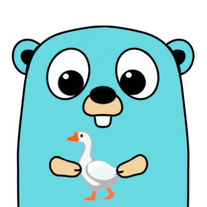

# 🪿 LinGoose

[](https://github.com/henomis/lingoose/actions/workflows/test.yml) [](https://godoc.org/github.com/henomis/lingoose) [](https://goreportcard.com/report/github.com/henomis/lingoose) [](https://github.com/henomis/lingoose/releases)

**LinGoose** (_Lingo + Go + Goose_ 🪿) aims to be a complete Go framework for creating LLM apps. 🤖 ⚙️

> **Did you know?** A goose 🪿 fills its car 🚗 with goose-line ⛽!

here below an image from docs/assets/img/lingoose.png

# Overview
**LinGoose** is a powerful Go framework for developing Large Language Model (LLM) based applications using pipelines. It is designed to be a complete solution and provides multiple components, including Prompts, Templates, Chat, Output Decoders, LLM, Pipelines, and Memory. With **LinGoose**, you can interact with LLM AI through prompts and generate complex templates. Additionally, it includes a chat feature, allowing you to create chatbots. The Output Decoders component enables you to extract specific information from the output of the LLM, while the LLM interface allows you to send prompts to various AI, such as the ones provided by OpenAI. You can chain multiple LLM steps together using Pipelines and store the output of each step in Memory for later retrieval. **LinGoose** also includes a Document component, which is used to store text, and a Loader component, which is used to load Documents from various sources. Finally, it includes TextSplitters, which are used to split text or Documents into multiple parts, Embedders, which are used to embed text or Documents into embeddings, and Indexes, which are used to store embeddings and documents and to perform searches.

# Components
**LinGoose** is composed of multiple components, each one with its own purpose.

| Component | Package|Description |
| --- | --- | ---|
|**Prompt** | [prompt](prompt/)| Prompts are the way to interact with LLM AI. They can be simple text, or more complex templates. Supports **Prompt Templates** and  **[Whisper](https://openai.com) prompt**|
|**Chat Prompt** | [chat](chat/) | Chat is the way to interact with the chat LLM AI. It can be a simple text prompt, or a more complex chatbot. |
|**Decoders** | [decoder](decoder/) | Output decoders are used to decode the output of the LLM. They can be used to extract specific information from the output. Supports **JSONDecoder** and **RegExDecoder** |
|**LLMs** |[llm](llm/) | LLM is an interface to various AI such as the ones provided by OpenAI. It is responsible for sending the prompt to the AI and retrieving the output. Supports **[OpenAI](https://openai.com)**|
|**Pipelines** | [pipeline](pipeline/)|Pipelines are used to chain multiple LLM steps together. |
|**Memory** | [memory](memory/)|Memory is used to store the output of each step. It can be used to retrieve the output of a previous step. Supports memory in **Ram**|
|**Document** | [document](document/)|Document is used to store a text |
|**Loaders** | [loader](loader/)|Loaders are used to load Documents from various sources. Supports **TextLoader** and **DirectoryLoader**. |
|**TextSplitters**| [textsplitter](textsplitter/)|TextSplitters are used to split text or Documents into multiple parts. Supports **RecursiveTextSplitter**.|
|**Embedders** | [embedder](embedder/)|Embedders are used to embed text or Documents into embeddings. Supports **[OpenAI](https://openai.com)** |
|**Indexes**| [index](index/)|Indexes are used to store embeddings and documents and to perform searches. Supports **SimpleVectorIndex** and **[Pinecone](https://pinecone.io)**|

# Usage

Please refer to the [examples directory](examples/) to see other examples. However, here is an example of what **LinGoose** is capable of:

_Talk is cheap. Show me the [code](examples/)._ - Linus Torvalds

```go
package main

import (
	"context"
	"encoding/json"
	"fmt"

	"github.com/henomis/lingoose/chat"
	"github.com/henomis/lingoose/decoder"
	"github.com/henomis/lingoose/llm/openai"
	"github.com/henomis/lingoose/memory/ram"
	"github.com/henomis/lingoose/pipeline"
	"github.com/henomis/lingoose/prompt"
)

func main() {

	cache := ram.New()

	llmChatOpenAI, err := openai.New(openai.GPT3Dot5Turbo, openai.DefaultOpenAITemperature, openai.DefaultOpenAIMaxTokens, true)
	if err != nil {
		panic(err)
	}

	llmOpenAI, err := openai.New(openai.GPT3TextDavinci002, openai.DefaultOpenAITemperature, openai.DefaultOpenAIMaxTokens, true)
	if err != nil {
		panic(err)
	}

	prompt1, _ := prompt.NewPromptTemplate(
		"You are a {{.mode}} {{.role}}",
		map[string]string{
			"mode": "professional",
		},
	)
	prompt2, _ := prompt.NewPromptTemplate(
		"Write a {{.length}} joke about a {{.animal}}.",
		map[string]string{
			"length": "short",
		},
	)
	chat := chat.New(
		chat.PromptMessage{
			Type:   chat.MessageTypeSystem,
			Prompt: prompt1,
		},
		chat.PromptMessage{
			Type:   chat.MessageTypeUser,
			Prompt: prompt2,
		},
	)

	llm1 := pipeline.Llm{
		LlmEngine: llmChatOpenAI,
		LlmMode:   pipeline.LlmModeChat,
		Chat:      chat,
	}
	pipeStep1 := pipeline.NewStep(
		"step1",
		llm1,
		nil,
		cache,
	)

	prompt3, _ := prompt.NewPromptTemplate(
		"Considering the following joke.\n\njoke:\n{{.output}}\n\n{{.command}}",
		map[string]string{
			"command": "Put the joke in a JSON object with only one field called 'joke'. " +
				"Do not add other json fields. Do not add other information.",
		},
	)
	llm2 := pipeline.Llm{
		LlmEngine: llmOpenAI,
		LlmMode:   pipeline.LlmModeCompletion,
		Prompt:    prompt3,
	}
	joke := struct {
		Joke string `json:"joke"`
	}{}
	pipeStep2 := pipeline.NewStep(
		"step2",
		llm2,
		decoder.NewJSONDecoder(&joke),
		cache,
	)

	pipe := pipeline.New(pipeStep1, pipeStep2)

	values := map[string]string{
		"role":   "joke writer",
		"animal": "goose",
	}
	response, err := pipe.Run(context.Background(), values)
	if err != nil {
		panic(err)
	}

	fmt.Printf("Final output: %#v\n", response)
	fmt.Println("---Memory---")
	dump, _ := json.MarshalIndent(cache.All(), "", "  ")
	fmt.Printf("%s\n", string(dump))

}
```

Running this example will produce the following output:

```
---SYSTEM---
You are a professional joke writer
---USER---
Write a short joke about a goose.
---AI---
Why did the goose cross the playground? To get to the other slide!
---USER---
Considering the following joke.

joke:
Why did the goose cross the playground? To get to the other slide!

Put the joke in a JSON object with only one field called 'joke'. Do not add other json fields. Do not add other information.
---AI---
{
        "joke": "Why did the goose cross the playground? To get to the other slide!"
}
Final output: &struct { Joke string "json:\"joke\"" }{Joke:"Why did the goose cross the playground? To get to the other slide!"}
---Memory---
{
  "step1": {
    "output": "Why did the goose cross the playground? To get to the other slide!"
  },
  "step2": {
    "joke": "Why did the goose cross the playground? To get to the other slide!"
  }
}
```

# Installation
Be sure to have a working Go environment, then run the following command:

```shell
go get github.com/henomis/lingoose
```


# License
© Simone Vellei, 2023~`time.Now()`
Released under the [MIT License](LICENSE)
